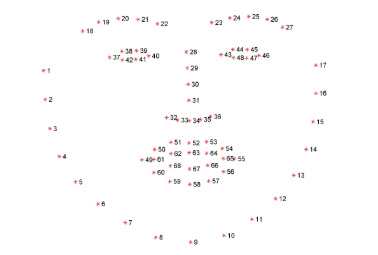
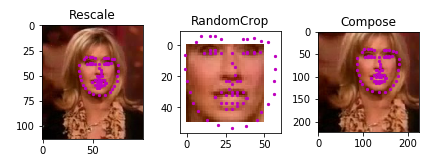

# Facial-Keypoint-Detection Udacity Project
**Project Overview**

In this project, you’ll combine your knowledge of computer vision techniques and deep learning architectures to build a facial keypoint detection system that takes in any image with faces, and predicts the location of 68 distinguishing keypoints on each face!

Facial keypoints include points around the eyes, nose, and mouth on a face and are used in many applications. These applications include: facial tracking, facial pose recognition, facial filters, and emotion recognition. Your completed code should be able to look at any image, detect faces, and predict the locations of facial keypoints on each face. Some examples of these keypoints are pictured below.

This project will be all about defining and training a convolutional neural network to perform facial keypoint detection, and using computer vision techniques to transform images of faces. 
Facial keypoints (also called facial landmarks) are the small magenta dots shown on each of the faces in the image above. In each training and test image, there is a single face and 68 keypoints, with coordinates (x, y), for that face. These keypoints mark important areas of the face: the eyes, corners of the mouth, the nose, etc. These keypoints are relevant for a variety of tasks, such as face filters, emotion recognition, pose recognition, and so on. Here they are, numbered, and you can see that specific ranges of points match different portions of the face.

The project will be broken up into a few main parts in four Python notebooks

Notebook 1 : Loading and Visualizing the Facial Keypoint Data

Notebook 2 : Defining and Training a Convolutional Neural Network (CNN) to Predict Facial Keypoints

Notebook 3 : Facial Keypoint Detection Using Haar Cascades and your Trained CNN

Notebook 4 : Fun Filters and Keypoint Uses

model.py : Structure of the neural network. 

